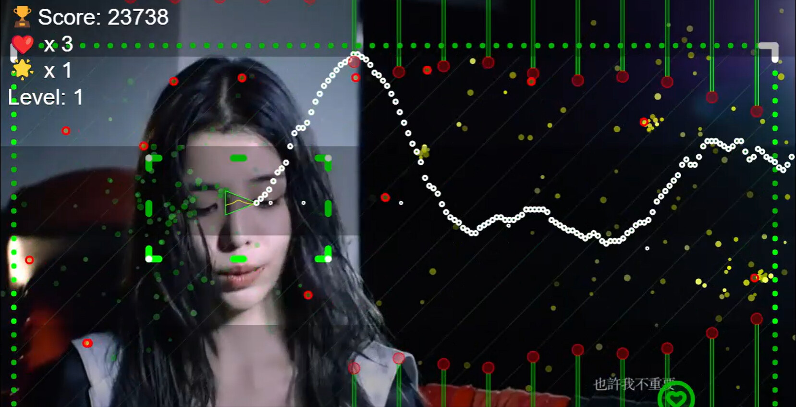
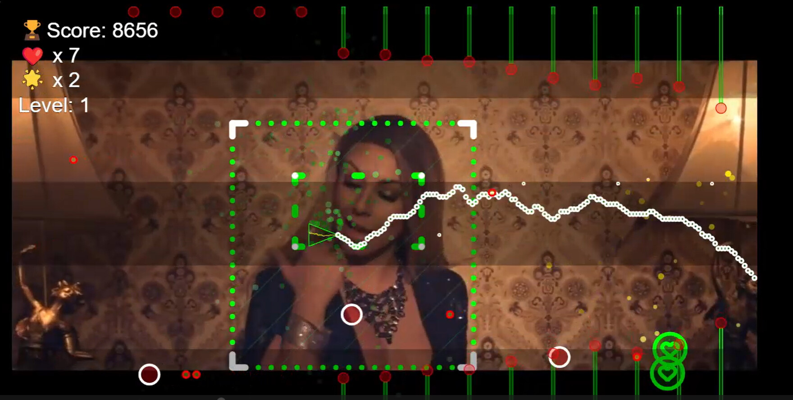
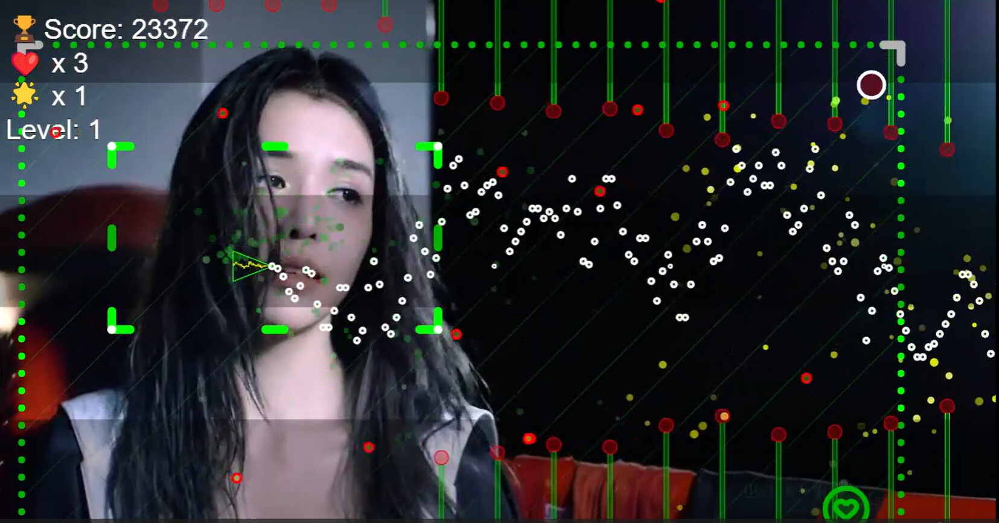
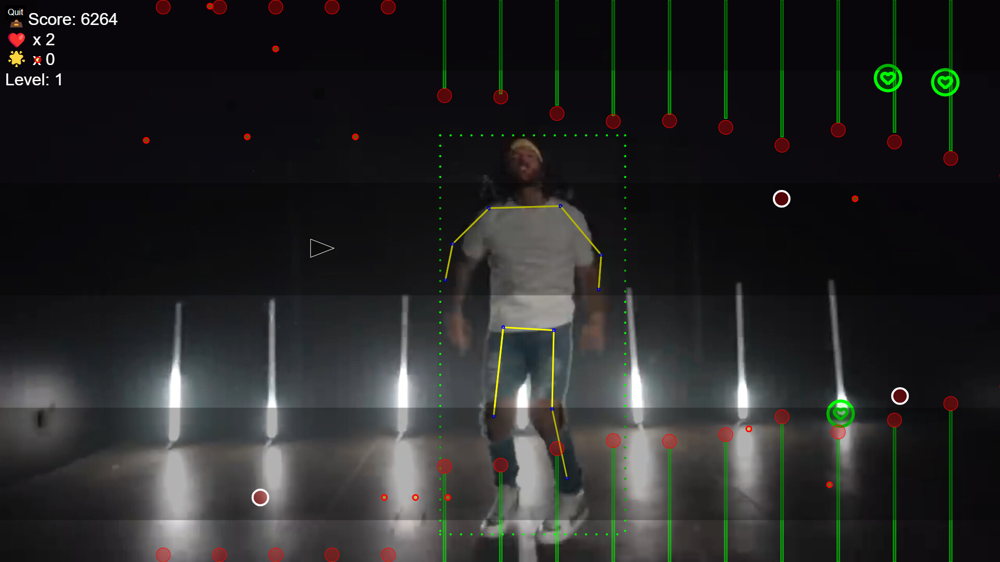
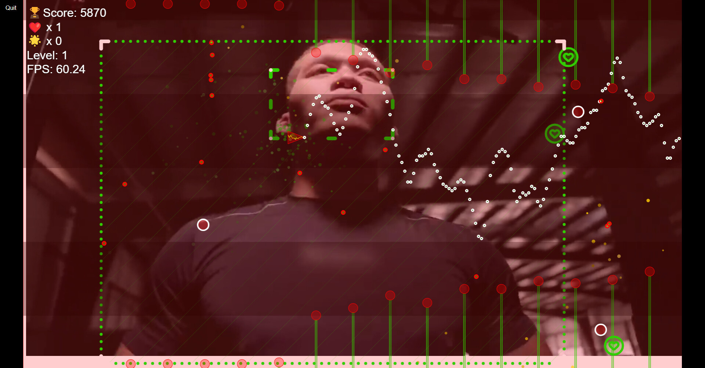
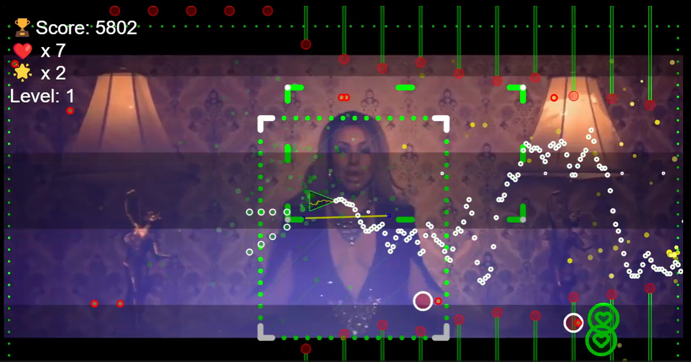

# [Pixelgroove](https://store.steampowered.com/app/2871570/Pixelgroove)

https://github.com/user-attachments/assets/ca472ee8-4c1f-4e84-abde-90d3c07c4cb7

Pixelgroove transforms your music videos into dynamic, interactive shooter experiences. The game analyzes the visual elements and rhythms of your videos, creating unique gameplay challenges for each track.

It uses p5.js with out-of-the-box ML models to do object detection, face recognition and pose estimation (via blaze-face, coco, and posenet). 

## [YouTube Video Demo](https://youtu.be/_yfUnCqTTuc?si=khm1DMwF08Fv0SMM)

Available On: [Steam](https://store.steampowered.com/app/2871570/Pixelgroove)

## Run: 

### Setup (Configure npm):
Without this you will keep getting erros related to posenet:

`npm config set legacy-peer-deps true`

You may need to do instlal this way too:

`npm install --legacy-peer-deps`

`npm start`

# Screenshots:

## Coding Guidelines 
For coding standards and practices, see the [Coding Guidelines](./CODING_GUIDELINES.md).
Try to follow them to the best of your ability.

## Build the documentation:
npm run make-docs

## To build installer (placed in out/Augmented Media):

npm run make

## Code Structure

Using electron (plus tsyringe and p5.js) and so *main.ts*, *renderer.ts*, *preload.js* and *core/Setup.ts* are the "entry points" for the codebase.

## Issues:

There are a few known bugs, namely going full screen can cause issues when analyzing (pre-procssing) a video file. Certain video files also seem to cause problems.
Ideally can restrict to mp4 filetype. 

The ML models, like blaze-face, don't often work as well as one would expect. Combining results from posenet and blaze-face to detect faces would be ideal but not implemented.

### Node version:

Node: 18.16.1

### Credits & Attributions:
This project incorporates footage/screenshots from the following Creative Commons Music Videos:

[NEFFEX - My Way 😤 (Official Music Video) [Copyright Free] No.158, Author: **NEFFEX**](https://www.youtube.com/watch?v=a6j5lbt6OLQ)

[Maía - Un Beso De Su Boca (Video Oficial), Author: MAIA MUSICAL](https://www.youtube.com/watch?v=XoHIcfI7Z4Q)

[李毓芬Tia Lee《是我不夠好Not Good Enough》Official Music Video HD, Author: Passion Sisters【宏將多利安國際股份有限公司](https://www.youtube.com/watch?v=BsvIwqyiaJw)
